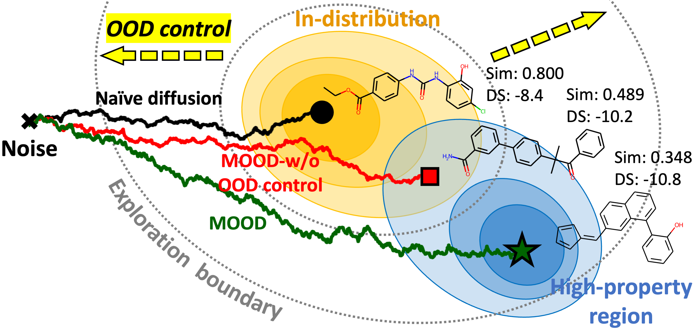

<h1 align="center">Exploring Chemical Space with<br>Score-based Out-of-distribution Generation</h1>

This is the official code repository for the paper [Exploring Chemical Space with Score-based Out-of-distribution Generation](https://arxiv.org/abs/2206.07632) (ICML 2023), in which we propose *Molecular Out-Of-distribution Diffusion (MOOD)*.

<p align="center">
    
</p>

## Contribution

+ We propose a novel score-based generative model for OOD generation, which *overcomes the limited explorability of previous models* by leveraging the novel OOD-controlled reverse-time diffusion.
+ Since the extended exploration space by the OOD control contains molecules that are chemically implausible, we propose a framework for molecule optimization that *leverages the gradients of the property prediction network* to confine the generated molecules to a novel yet chemically meaningful space.
+ We experimentally demonstrate that the proposed MOOD can generate *novel molecules that are drug-like, synthesizable, and have high binding affinity* for five protein targets, outperforming existing molecule generation methods.

## Dependencies
Run the following commands to install the dependencies:
```bash
conda create -n mood python=3.8
conda activate mood
conda install -c pytorch pytorch==1.12.0 cudatoolkit=11.3
conda install -c conda-forge rdkit=2020.09 openbabel
pip install tqdm pyyaml pandas easydict networkx==2.6.3 numpy==1.20.3
chmod u+x scorer/qvina02
```

## Running Experiments

### 1. Preparation
MOOD utilizes [GDSS](https://github.com/harryjo97/GDSS) as its backbone diffusion model. In our paper, we utilized the pretrained `gdss_zinc250k_v2.pth` GDSS checkpoint, which is in the folder `checkpoints/ZINC250k`.

Run the following command to preprocess the ZINC250k dataset:
```bash
python data/preprocess.py
```

### 2. Training a Property Prediction Network $P_\phi$
We provide the pretrained property predictor networks ($P_\text{obj}=\hat{\text{DS}} \times \text{QED} \times \hat{\text{SA}}$) for target proteins parp1, fa7, 5ht1b, braf, and jak2, respectively (`prop_parp1.pth`, `prop_fa7.pth`, `prop_5ht1b.pth`, `prop_braf.pth`, and `prop_jak2.pth`, respectively), in the folder `checkpoints/ZINC250k`.

To train your own property predictor, run the following command:
```bash
CUDA_VISIBLE_DEVICES=${gpu_id} python main.py --type train --config prop_train
```
You can modify hyperparameters in `config/prop_train.yaml`.

### 3. Generation and Evaluation
To generate molecules, run the following command:
```sh
CUDA_VISIBLE_DEVICES=${gpu_id} python main.py --type sample --config sample
```
You can modify hyperparameters in `config/sample.yaml`.

## Citation
If you find this repository and our paper useful, we kindly request to cite our work.

```BibTex
@article{lee2023MOOD,
  author    = {Seul Lee and Jaehyeong Jo and Sung Ju Hwang},
  title     = {Exploring Chemical Space with Score-based Out-of-distribution Generation},
  journal   = {Proceedings of the 40th International Conference on Machine Learning},
  year      = {2023}
}
```
